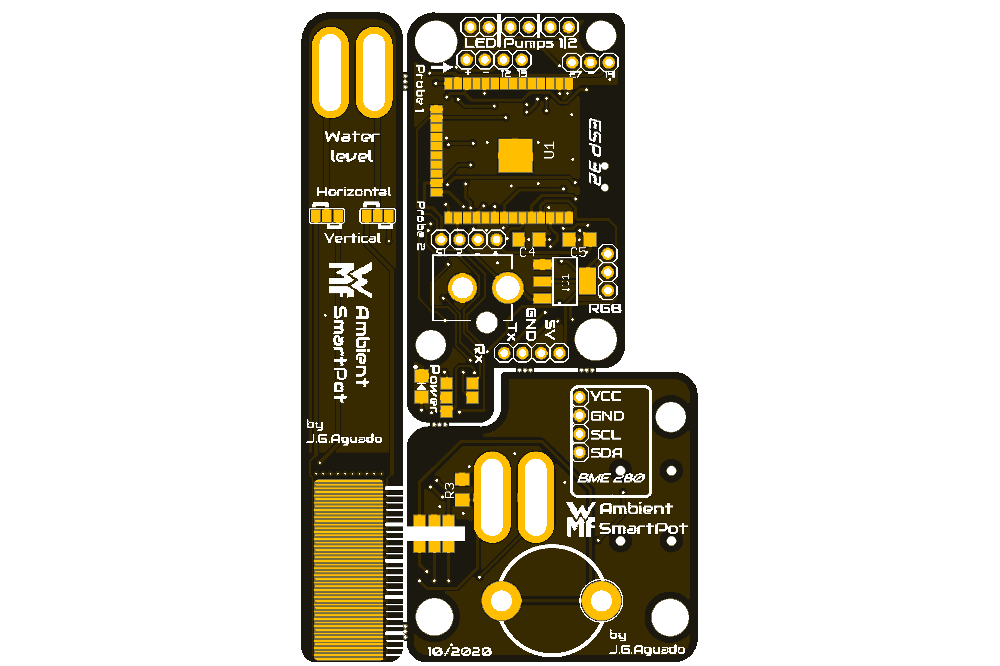
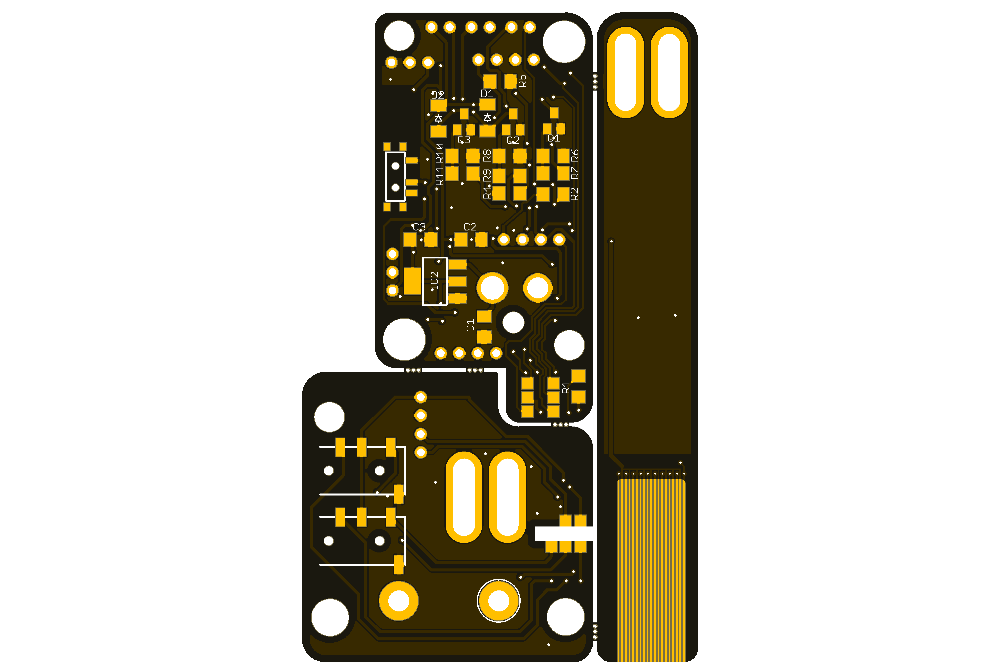

[![GitHub Release][releases-shield]][releases]
[![License][license-shield]](LICENSE)

[![Project Maintenance][maintenance-shield]][maintenance]
[![BuyMeCoffee][buymecoffee-shield]][buymecoffee]

# Smart Herbs
The Smart Herbs project is a set of PCBs compatible with the [WMF Ambient Pot](https://www.wmf.com/es/wmf-ambient-kraeuter-athome.html) that provides a full smart solution for monitoring the plants. 

It is designed to serve as a an alternative to the original design poor in smart functionalities, being 100% compatible with ESPhome and the Home Assistant environment. 

   
      

### Specifications:
---
 * ESP32 based (Bluetooth and Wifi functionalities)
 * Neopixel LEDs compatibility
 * Support for the original "touch" functionality
 * Port for soldering a BME 280 module
 * Resistor based water level sensor for the tank

### Applications:
---
Monitor the pot conditons (water tank leve, temperature & environment pressure) and stream it to you Home Assistant setup, touch the pot for displaying the water level through the Neopixel ring and get notificatified by color alerts when the water level is critical.

## Project tree
---
<ul>
   <li><a href="./Design/">Design</a></li>
   <li><a href="./Documentation/">Documentation</a></li>

   <li><a href="./README.md">README.md</a></li>
</ul>

## Disclaimer
---
This is a customized set of boards compatible with the [WMF Ambient Pot](https://www.wmf.com/es/wmf-ambient-kraeuter-athome.html) and it is not an original design from WMF. 

[releases-shield]: https://img.shields.io/github/release/JGAguado/Smart_Herbs.svg?style=for-the-badge
[releases]: https://github.com/JGAguado/Smart_Herbs/releases

[license-shield]: https://img.shields.io/badge/License-CC%20BY--NC--SA%204.0-lightgrey.svg?style=for-the-badge

[maintenance-shield]: https://img.shields.io/badge/maintainer-J.%20G.%20Aguado-blue.svg?style=for-the-badge
[maintenance]: https://github.com/JGAguado

[buymecoffee-shield]: https://img.shields.io/badge/buy%20me%20a%20coffee-support-yellow.svg?style=for-the-badge
[buymecoffee]: https://www.buymeacoffee.com/J.G.Aguado
